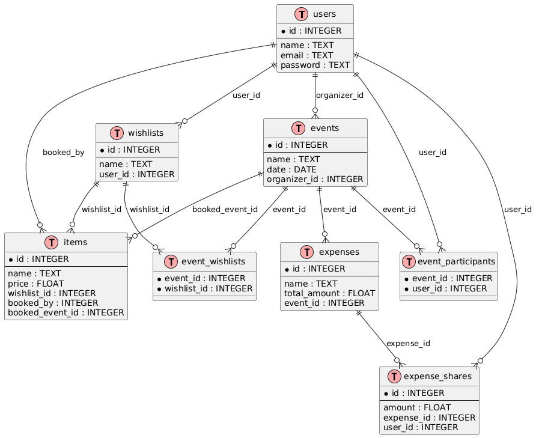
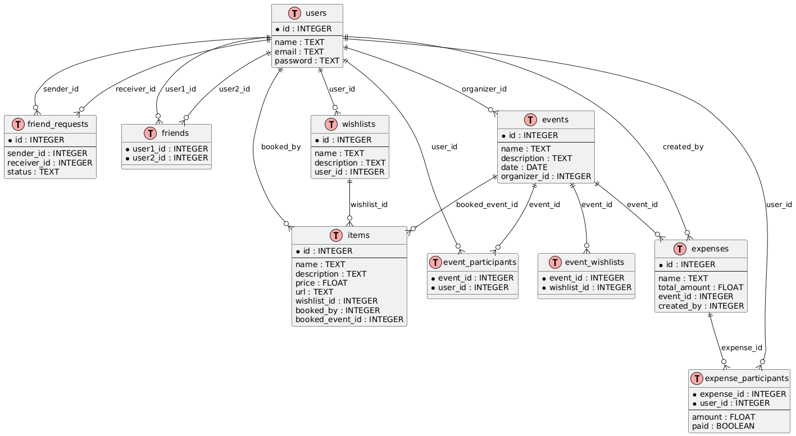

# WishlistEvents

## Структура страниц

### 1. Лендинг
- Hero-блок с описанием проекта
- Кнопки: «Вход», «Регистрация»
- 3 карточки с ключевыми фишками (вишлисты, события, складчина)

---

### 2. Логин / Регистрация
- Переключение между формами (одна страница)
- Поля: Имя, Email, Пароль
- Кнопка: «Зарегистрироваться» / «Войти»

---

### 3. Дашборд (главная после входа)
**Шапка:** лого, имя пользователя, иконка настроек

**Вкладка «Мои события»:**
- Карточки событий (название, дата)
- Кнопка «+ Создать событие»

**Вкладка «Мои вишлисты»:**
- Карточки вишлистов (название, кол-во позиций)
- Кнопка «+ Создать вишлист»

---

### 4. Страница события
**Шапка:** название события, дата, кнопка «Назад»

**4 вкладки:**

| Вкладка | Содержание |
|---------|-----------|
| Вишлист | Список подарков (название, цена, статус, кнопка «Забронировать») |
| Финансы | Список трат, прогресс-сбора, блок балансов, кнопка «+ Добавить трату» |
| Лента | Хронология действий, поле ввода комментария |
| Участники | Список участников (аватар, имя, отметка организатора) |

---

### 5. Страница вишлиста (личный)
**Шапка:** название вишлиста, кнопка «Назад»

**Список позиций:**
- Название, цена
- Иконки «Редактировать», «Удалить»

**Кнопка «+ Добавить позицию»** → модалка с полями: Название, Цена (опц), Ссылка (опц), Описание (опц)

---

### 6. Настройки / Профиль (заглушка)
- Имя
- Email
- Кнопка «Выйти»

### 7. Друзья 🆕

**Шапка:** название «Друзья», кнопка «Назад» (возврат на Дашборд)

**3 вкладки:**

| Вкладка | Содержание |
|---------|-----------|
| Друзья | Список друзей (аватар, имя, кнопка «Удалить из друзей») |
| Запросы | Входящие запросы на дружбу (имя отправителя, кнопки «Принять» / «Отклонить») |
| Поиск | Поле ввода для поиска пользователей (по имени). Результаты поиска: аватар, имя, кнопка «Добавить в друзья» (если ещё не друг и нет активного запроса) |

**Особенности:**
- Поиск работает по частичному совпадению (по началу имени)
- Если пользователь уже отправил запрос, кнопка заменяется на «Запрос отправлен» (disabled)
- Если пользователь уже друг — кнопка не показывается или заменяется на иконку дружбы

---

### Навигация (дополненная)

| Откуда | Куда |
|--------|------|
| Лендинг → Логин/Регистрация | Кнопки |
| Логин/Регистрация → Дашборд | После успешного входа |
| Дашборд → Страница события | Клик по карточке события |
| Дашборд → Страница вишлиста | Клик по карточке вишлиста |
| Дашборд → Настройки | Иконка в шапке |
| Дашборд → Друзья | Кнопка / иконка в шапке (или отдельный пункт меню) |
| Страница события / вишлиста / друзей → Дашборд | Кнопка «Назад» |

---

### Компоненты
- Кнопки (3 вида: primary, secondary, danger)
- Инпуты (обычный, ошибка)
- Карточки (события, вишлиста, подарка, траты)
- Табы (переключение вкладок)
- Модалки (создать вишлист, добавить позицию, добавить трату)
- Прогресс-бар (для сбора средств)

## API Эндпоинты

### 1. Пользователи

| Метод | Эндпоинт | Для чего | Статус |
|-------|----------|----------|--------|
| POST | `/register` | Зарегистрировать нового пользователя | ✅ |
| POST | `/login` | Войти в систему (получить user_id) | ✅ |
| GET | `/users/search?q=` | Поиск пользователей по имени/email | 🆕 |

---

### 2. Вишлисты

| Метод | Эндпоинт | Для чего | Статус |
|-------|----------|----------|--------|
| GET | `/wishlists` | Получить список моих вишлистов | ✅ |
| POST | `/wishlists` | Создать новый вишлист | ✅ |
| GET | `/wishlists/{id}/items` | Получить позиции вишлиста | ✅ |
| POST | `/wishlists/{id}/items` | Добавить позицию в вишлист | ✅ |
| DELETE | `/wishlists/{id}` | Удалить вишлист | ✅ |
| DELETE | `/wishlists/{id}/items/{item_id}` | Удалить позицию из вишлиста | ✅ |

---

### 3. События

| Метод | Эндпоинт | Для чего | Статус |
|-------|----------|----------|--------|
| GET | `/events` | Получить список моих событий | ✅ |
| POST | `/events` | Создать новое событие | ✅ |
| GET | `/events/{id}` | Получить данные события + участников | ✅ |
| POST | `/events/{id}/wishlist` | Привязать вишлист к событию | ✅ |

---

### 4. Бронирование

| Метод | Эндпоинт | Для чего | Статус |
|-------|----------|----------|--------|
| GET | `/events/{id}/items` | Получить позиции события (с флагом бронирования) | ✅ |
| POST | `/events/{id}/items/{item_id}/book` | Забронировать подарок | ✅ |
| DELETE | `/events/{id}/items/{item_id}/book` | Отменить бронирование | ✅ |

---

### 5. Друзья

| Метод | Эндпоинт | Для чего | Статус |
|-------|----------|----------|--------|
| GET | `/friends` | Получить список друзей | 🆕 |
| GET | `/friends/requests` | Получить входящие запросы на дружбу | 🆕 |
| POST | `/friends/request/{id}` | Отправить запрос в друзья | 🆕 |
| PUT | `/friends/request/{id}/accept` | Принять запрос на дружбу | 🆕 |
| DELETE | `/friends/request/{id}/reject` | Отклонить запрос | 🆕 |
| DELETE | `/friends/{id}` | Удалить пользователя из друзей | 🆕 |

---

### 6. Финансы

| Метод | Эндпоинт | Для чего | Статус |
|-------|----------|----------|--------|
| GET | `/events/{id}/expenses` | Получить список трат и долгов | ✅ |
| POST | `/events/{id}/expenses` | Добавить общую трату (с выбором участников) | 🔄 расширен |
| GET | `/events/{id}/expenses/{id}` | Получить детали конкретной траты | 🆕 |
| PUT | `/events/{id}/expenses/{id}/pay` | Отметить оплату своей доли | 🆕 |
| GET | `/events/{id}/balances` | Получить балансы (кто кому должен) | 🆕 |

---

### 7. Лента

| Метод | Эндпоинт | Для чего | Статус |
|-------|----------|----------|--------|
| GET | `/events/{id}/feed` | Получить ленту действий события | ✅ |
| POST | `/events/{id}/comments` | Добавить комментарий | ✅ |

---

## Легенда

| Знак | Значение |
|------|----------|
| ✅ | Уже реализовано |
| 🆕 | Новый эндпоинт (требуется добавить) |
| 🔄 | Существующий, но требует расширения |

## База данных

В docs лежит код uml

### Обновлённая база

## Структура
- сервер для бэка
- сервер для фронта
- postgres база

## Демо
-  компоновка через docker compose
-  небольшая заполненная база 
